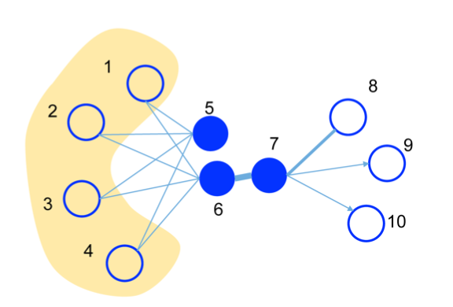
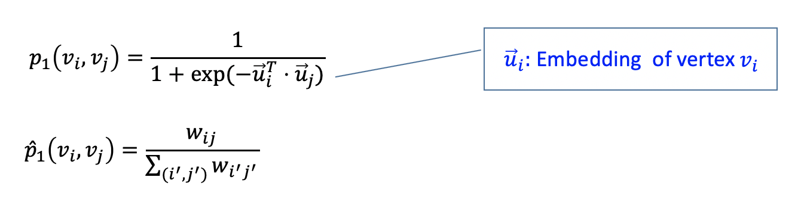
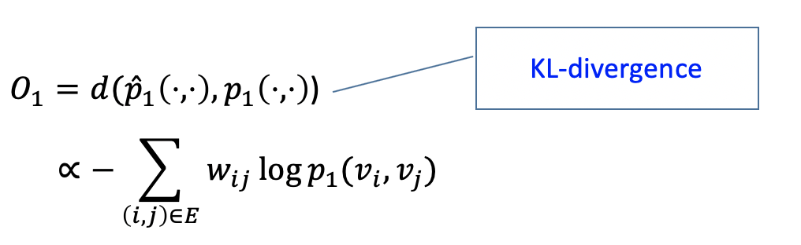
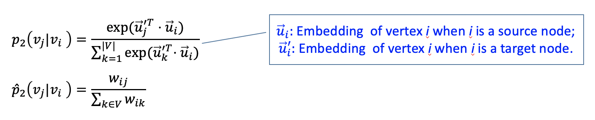
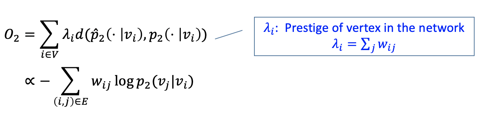
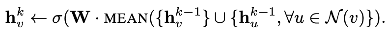
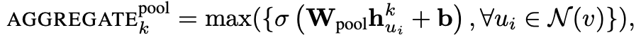

<small>최종 수정일 : 2019-12-14</small>

> Graph Neural Network(GNN) 에 대해 간략히 정리한 포스트입니다.
> 잘못된 것이 있을 수 있습니다.
> 댓글로 알려주시면 감사하겠습니다!

## Machine Learning Tasks with Graph

- Node Classification  
  Nearest Neighbor 를 이용해 이웃한 node 들을 본다. 이 때 이웃한 노드들이 equivalent 하다면 그 다음 단계의 노드들까지 고려한다.  

- Link Prediction  
  현재 노드에서 목표 노드까지 edge 가 직접적으로 없을 때, link 를 예측해본다. 이 때, 직접 연결된 edge 를 1이라고 할 때, 두 개의 edge 를 거쳐가면 2 라고 생각하는 식이다.

- Community Detection  
  
- Network Similarity

## Node Representation Learning

### LINE: Large-scale Information Network Embedding

#### Summary

- Operational Range : directed, undirected, weighted graphs
- Objective functions : Preserve the first & second-order proximity
- Scalability :  
  - Asynchronous stochastic gradient descent(ASGD)
  - Millions of node and billions of edges on a single machine

#### First-order Proximity

위의 그림에서 6-7 의 edge 가 두껍다.  
직접적인 연결관계에 대해서 관련도가 높다는 것을 의미한다.

e.g. 문장에서 같이 등장하는 단어. information + provide 등의 동사

여기서 1st proximity 는 $p_1,\ \hat{p}_1$ 의 KL divergence 이다.

#### Second-order Proximity

위의 그림에서 5, 6의 second-order proximity 가 높다.  
직접적으로 연결된 노드는 없으나(no direct edges) 연결된 노드들(neighbors)이 비슷한 경우를 의미한다.  

e.g. 문장에서 대신 쓰일 수 있는 것. good -> bad, excellent, reasonable 등의 대체될만한 것.  

> The degree of overlap of two people's friendship networks correlates with the strangth of ties between them" - Mark Granovetter

여기서 2nd proximity 는 $p_2,\ \hat{p}_2$ 의 KL divergence 이다.  

#### Features

- Optimization Tricks : Stochastic gradient descent + Negative Sampling  
  - 2nd-proximity 의 objective function 의 분모부분이 $O(N)$ 이라 전체적으로는 $O(N^2)$ 의 계산이 필요. -> Negative Sampling 으로 존재하지 않은 edge 에 대해 멀어지도록 해줌
  - Randomly sample an edge and multiple negative deges
- ASGD 로 학습 -> gradient 에 간선 가중치가 곱해짐 -> 간선 가중치가 크다면 learning rate 와 무관하게 학습 안됨 => gradient explosion  
  - 이런 문제를 해결하기 위해 가중치 m 인 edge 를 가중치 1 인 edge m 개로 unfolding => 메모리 비효율
  - egde sampling : 가중치를 비율대로 나눔.(e.g., 300, 100 -> 3개, 1개 의 edge)
- Complexity : $O(d \times K \times |E|)$

### DeepWalk

_DeepWalk_ 는 random walk 후 _SkipGram_ 을 진행한다.  

- random walk : 현재 선택된 노드와 연결된 노드 중 random 하게 움직임.  
  이는 근접 노드들은 similar embedding 일 것이라 생각하기 때문  

이는 만들어진 random vecor 에 대해 진행하며, softmax 를 이용해 node embedding update(by gradient descent) 를 진행한다.  

- SkipGram : window size 만큼 앞뒤로 트레이닝을 시도, 각각의 노드에 대해 따로 학습을 진행  
이를 통해 CBOW 보다 더 많은 학습이 가능하다.(window size=2 일 때 4배의 학습)

### node2vec

BFS 와 DFS 를 이용해 node 를 탐색  

- BFS : homophily, 비슷한 노드는 공통으로 연결된 노드가 많다.
- DFS : structural equivalence, 비슷한 노드는 네트워크에서 비슷한 구조적 위치에 존재한다.

node2vec 은 이 둘을 적절히 조합하는 hybrid strategy 를 사용한다.  

## Graph Neural Networks

Node 를 어떻게 embedding 해야할까?  

- Transductive Learning(i.e. embedding lookups)  
  - 변환 추론 : specific case to specific case.
  - 반대는 Inductive Learning(유도 학습) : training 시켜서 general rule 을 찾는다.

### Neighborhood Aggregation

sample neighborhood -> Aggregate feature information from neighbors -> predict graph context and label using aggregated information

$$
\begin{aligned}
h_v^0 &= x_v \\
h_v^k &= \sigma \left( W_k \sum_{u \in N(v)}{h_u^{k-1} \over |N(v)| + B_kh_v^{k-1}}\right),\ \forall k \gt 0 \\
z_v &= h_v^K
\end{aligned}
$$

### Training the Model

Unsupervised Loss : with cosine similarity function  

$$
J_G(z_v) = -\log\left( \sigma\left(z_v^Tz_u \right)\right) - Q\cdot \mathbb{E}_{u_n \sim P_n(v)}{\log \left( \sigma \left(-z_v^Tz_{u_n}\right) \right)}
$$

Supervised Loss : node classification (e.g., Xentropy)  

$$
L = \sum_{v \in V}{y_v\log\left( \sigma \left(w^Tz_v \right)\right) + \left(1-y_v\right) \log(1-\sigma(w^Tz_v))}
$$

### Inductive Learning

parameters / functions 공유가 가능하다.  
function 은 새로운 그래프에 적용될 수 있다.

### Graph Convolutional Networks

Basic :  

$$
h_v^k = \sigma \left( W_k \sum_{u \in N(v)}{h_u^{k-1} \over |N(v)| + B_kh_v^{k-1}}\right)
$$

GCN :  

$$
h_v^k = \sigma \left( W_k \sum_{u \in N(v) \cup v}{h_u^{k-1} \over \sqrt{|N(u)||N(v)}}\right)
$$

- an approximation of graph convolution
- more parameter sharing
- down-weights high degree neighbour  
  - counter-intuitive 한 부분일 수 있는데, unique 한 정보에 가치를 더 두는 것이라 생각해 볼 수 있다.  

### GraphSAGE

- mean : 간단  
  
- pool :  
    
  각각 이웃의 embedding 들에 $W_{pool}$ 을 곱하고 +b -> max pooling
  성능:시간 효율이 좋다.
- LSTM or GRU
  LSTM 을 적용해 볼 수 있다. 성능은 좋으나 느리다.

### Graph Attention Networks(GAT)

몇몇 이웃들은 더 중요할 수도 있다. -> Attention mechanism  

$$
h_v^k = \sigma \left( \sum_{u \in N(v) \cup v}{\alpha_{u,v}W^kh_v^{k-1}}\right)
$$

여기서 $\alpha_{u,v} = {\exp(\text{LeakyReLU}(a^T[Wh_v,Wh_u])) \over \sum_{u' \in N(v)\cup v}{\exp({\text{LeakyReLU}(a^T[Wh_v,Wh_{u'}]))}}}$ 이다.
