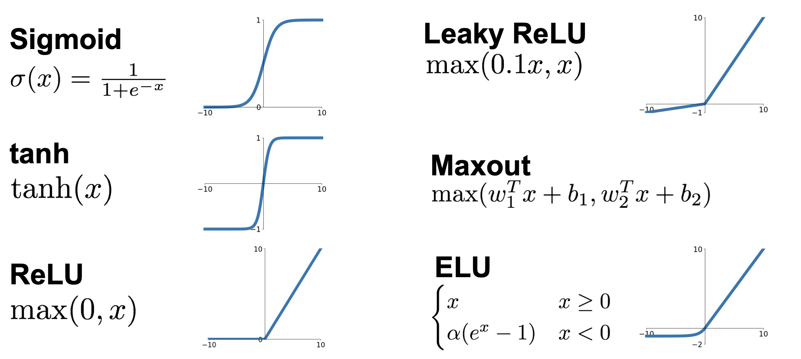
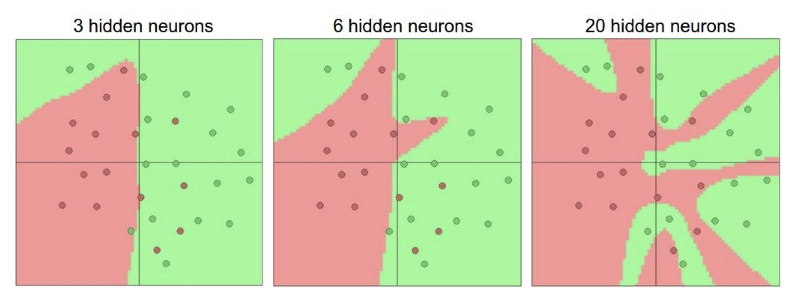
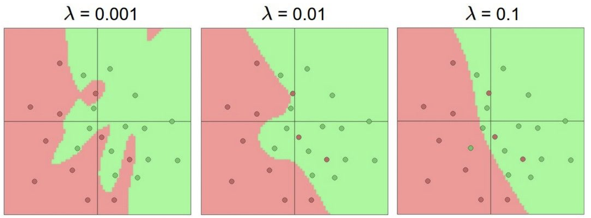
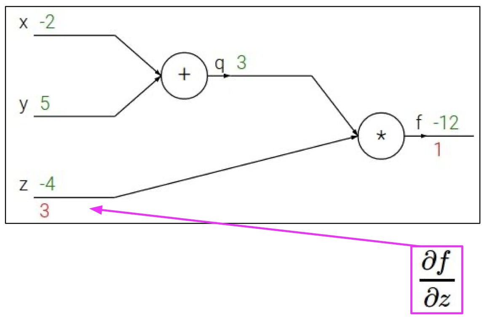
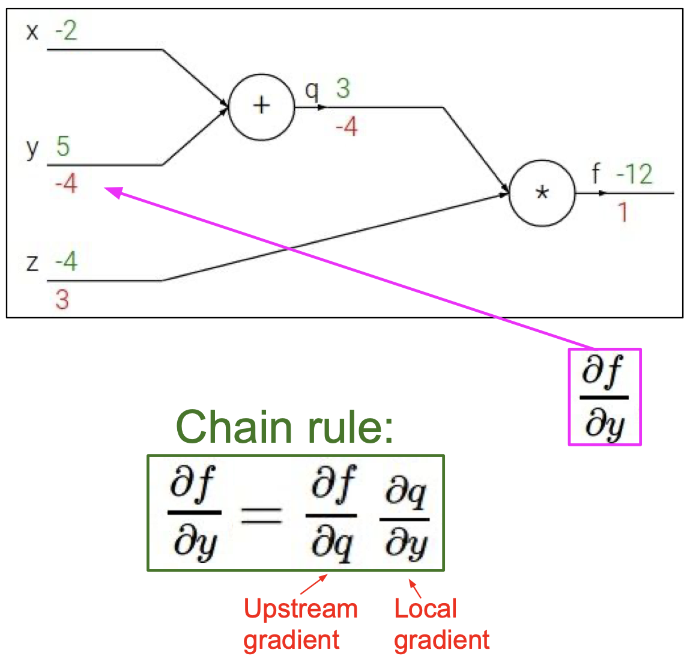
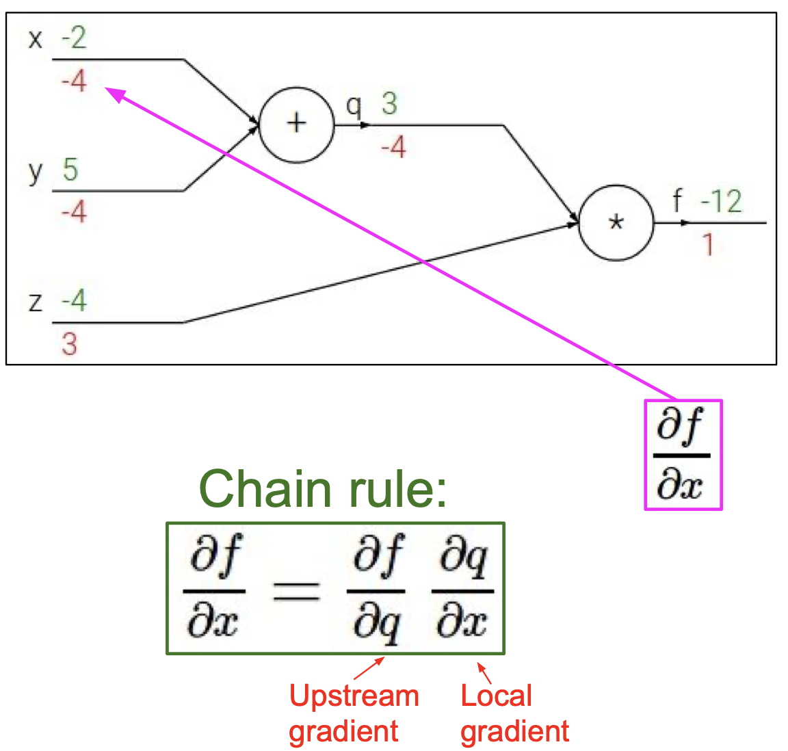
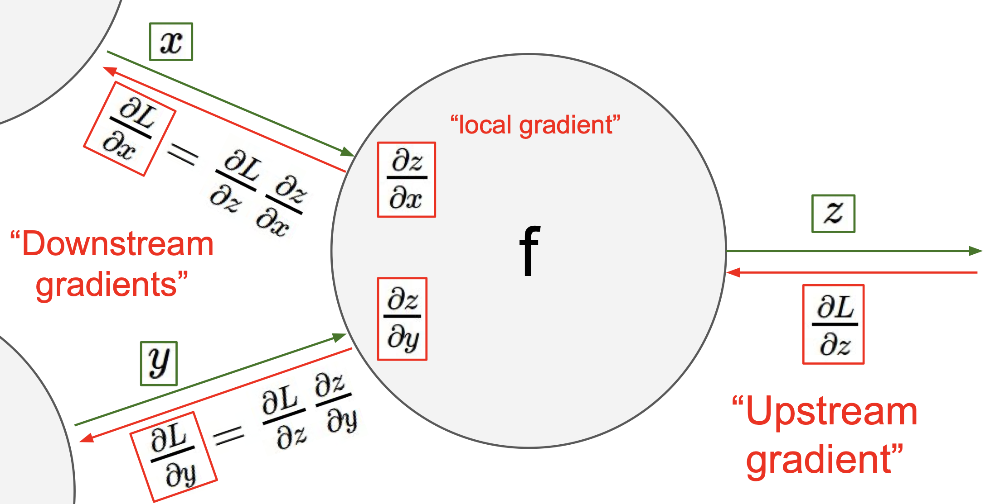
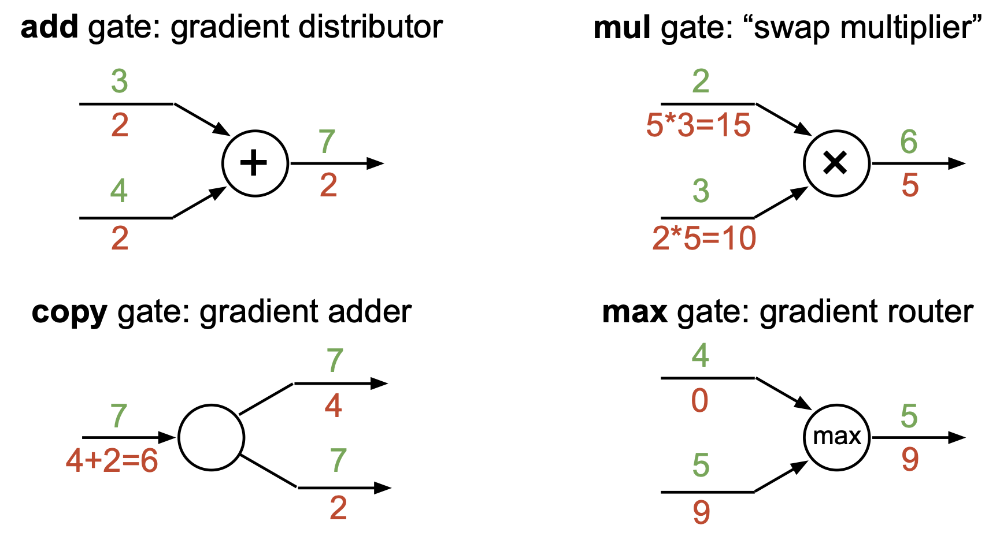
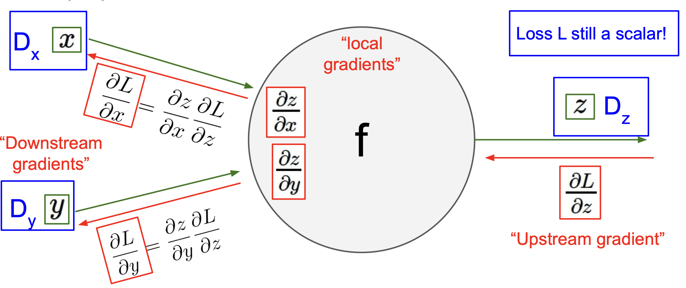

<small>최종 수정일 : 2019-10-11</small>

> 이 포스트는 스탠포드의 [cs231n](http://cs231n.stanford.edu) 4강 강의를 보고 공부 및 정리한 포스트입니다.  
> 잘못된 것이 있을 수 있습니다.  
> 댓글로 알려주시면 감사합니다!  

# Neural Networks

본격적으로 들어가기에 앞서 우리는 이전에 linear score function 를 알아보았다.

$f(x, W) = Wx$

이제 우리는 간단한 _2-layer Neural network_ 를 볼 것이다.

$f = W_2 \text{max} \left(0, W_1x \right)$

오, _2-layer neural network_ 라 해서 거창할 것 같았는데 별거 없네? 라고 생각할 수 있다.  

물론 보기엔 그럴 수도 있으나 layer 가 늘어나면서 복잡한 문제들을 놀라우리만큼 신기하게 해결해내는 것을 보게 된다.  
여기서  _2-layer neural network_ 는 _fully-connected network_ 또는 _MLP(multilayered perceptron)_ 으로도 불린다.  

여기서 _max_ 는 왜 있는 것일까? 만약에 없다고 생각하면 다음과 같이 쓸 수 있을 것이다.  

$f = W_2W_1x$  

이는 그저 또 하나의 linear function 이 되게 된다. 즉 지금까지 다뤘던 그것들과 다를 것이 없는 것이 된다는 말!  

이러한 _max_ 를 _activation function(활성 함수)_ 이라고 부르고 여기에는 다양한 종류의 함수들이 존재한다.  



이러한 활성 함수들 중 _sigmoid_ 가 많이 쓰여왔으나 현재는 _ReLU_ 가 가장 기본적으로 쓰이는 추세이다. <small>활성 함수에 대한 정리는 7강을 정리한 [포스트](https://younghk.github.io/cs231n-Training-Neural-Networks-Part-1/#activation-functions)에서 확인할 수 있다.</small>  

Neural Networks, 우리 말로 하면 신경망으로 아래와 같은 구조로 도식화 할 수 있다.


이렇게 모든 node 들이 다음 layer와 다 연결 되어 있어서 _fully-connected layer_ 라고 부르며 _Python_ 코드(numpy)로 나타내면 다음과 같다.

```python
import numpy as np
from numpy.random import randn

N, D_in, H, D_out = 64, 1000, 100, 10
x, y = randn(N, D_in), randn(N, D_out)
w1, w2 = randn(D_in, H), randn(H, D_out)

for t in range(2000):
    h = 1 / (1 + np.exp(-x.dot(w1)))
    y_pred = h.dot(w2)
    loss = np.square(y_pred - y).sum()
    print(t, loss)

    grad_y_pred = 2.0 * (y_pred - y)
    grad_w2 = h.T.dot(grad_y_pred)
    grad_h = grad_y_pred.dot(w2.T)
    grad_w1 = x.T.dot(grad_h * h * (1 - h))

    w1 -= 1e-4 * grad_w1
    w2 -= 1e-4 * grad_w2
```

layer 의 숫자에 따른 시각화를 하면,



뉴런이 많아 질 수록 복잡해지는 것을 볼 수 있다.



_hyperparameter_ 였던 $\lambda$ 의 크기에 따라 분류 모델의 복잡성을 확인할 수 있는데, $\lambda$가 커질 수록 일반화 되는 것을 볼 수 있다.  

이러한 방법은 생물의 신경세포(neuron) 에서 착안한 것으로, 구조상 비슷한 모습을 보인다.  


<small><small>드러나는 나의 악필^_^</small></small>

이처럼 각 가중치들에 의해 계산된 값을 활성 함수(_activation function_)을 통과 시켜서 다음으로 넘기는 방식이 기본적인 개념이다.  

> 그러나 인공신경망이 실제 신경망과 같지는 않다.  

재밌는 것은 최신의 연구내용을 보면, 생물학적 뉴런(biological neuron)은 복잡한 패턴을 가지고서 연산을 하는 것과 비슷하게 임의로 연결된 인공신경망(neural network)도 효과가 있다는 점이다.


그럼에도 불구하고 여전히 생물학적 뉴런은 인공신경망과 상당히 다른데, 

- 종류가 다양하다.
- Dentride(수상돌기)는 복잡한 비선형(non-linear) 계산이 가능하다.
- Synapse(시냅스)는 하나의 weight를 가진 시스템이 아닌 복잡한 비선형 동적 시스템(non-linear dynamical system)이다.

등등의 차이가 있다. <small>[Dendritic Computation. London and Hausser]</small>

자, 지금까지 배웠던 것을 간략하게 정리해본다면 다음과 같다.

$s = f(x;W_1, W_2) = W_2 \text{max} \left(0, W_1x \right)$ <small>&emsp;&emsp;Nonlinear score function</small>  
$L_i = \sum_{j \ne y_i} \text{max} \left(0, s_j - s_{y_i} + 1 \right)$ <small>&emsp;&emsp;&emsp;&emsp;&nbsp;SVM Loss</small>  
$R\left(W\right) = \sum_kW_k^2$ <small>&emsp;&emsp;&emsp;&emsp;&emsp;&emsp;&emsp;&emsp;&emsp;&emsp;&emsp;&emsp;Regularization</small>  
$L = {1 \over N} \sum_{i=1}^N L_i + \lambda R\left(W_1\right) + \lambda R\left(W_2\right)$ &emsp;<small>Total loss(data loss + regularization)</small>  

여기서 어떻게 gradient 를 구해야할까?  

일일히 손으로 미분을 하여 구해야하는 것을까? 한다고 해도 만약 SVM loss 에서 Softmax 로 바꾸고 싶다면 또 다시 일일히 구해야할까?  

한 눈에 봐도 별로 좋지 못한 계획인 것이 보인다.<small>(너는 다 계획이 있구나!)</small>  

우리는 이것보다 더 나은 역전파(Backpropagation)를 이용한 update를 하게 된다.  

## Backpropagation

예제를 통해 간단하게 backpropagation 과정을 따라가보자.

$f(x,y,z) = (x + y)z$  &emsp; &emsp; ($x=-2 \text{ , }y=5 \text{ , } z=-4$)


$q=x+y$ &emsp;${\partial q \over \partial x} = 1$ &emsp; ${\partial q \over \partial y} = 1$  
$f=qz$ &emsp;&emsp; ${\partial f \over \partial q} = z$ &emsp; ${\partial f \over \partial z} = q$

위와 같은 상황에서 각각의 편미분 값(gradient) 를 구해보자.


우선 자명하게도 ${\partial f \over \partial f} = 1$ 임을 쉽게 알 수 있다.



다음은 $z$ 에 대한 $f$의 순간변화율인데, 이는  
$q=x+y$ &emsp;${\partial q \over \partial x} = 1$ &emsp; ${\partial q \over \partial y} = 1$  
$f=qz$ &emsp;&emsp; ${\partial f \over \partial q} = z$ &emsp; ${\partial f \over \partial z} = q$  
에서 볼수 있듯이 $q$ 이다.
즉, ${\partial f \over \partial z} = q = 3$ 이 되게 된다.


${\partial f \over \partial q} = z = -4$ 역시 쉽게 알 수 있다.



이제 ${\partial f \over \partial y}$ 를 구해야하는데, 이는 바로 구할 수 없으니 ___chain rule___ 을 통해 계산해준다.  
여기서 볼 수 있듯이 ${\partial f \over \partial q}$ 를 _upstream<small>(global)</small> gradient_ , ${\partial q \over \partial y}$ 를 _local gradient_ 라고 부른다.  
_chain rule_ 에 의해 ${\partial f \over \partial y} = z \times 1 = -4$ 임을 알 수 있다.  



마찬가지로 _chain rule_ 에 의해 ${\partial f \over \partial x} = z \times 1 = -4$ 임을 알 수 있다.  

이러한 일련의 과정을 거쳐서 계산한 gradient 가 학습되게 되는데, 이것이 바로 ___Backpropagation___ 이다.  

이를 정리하면 아래와 같다.  



gradient flow 에 있어서 각 gate 들의 특성을 정리할 수 있는데 이는 다음과 같다.  



---

## Backpropagation with Vectors

우리는 지금까지 scalar 값에 대한 역전파 과정을 학습했다.  

그렇다면 vector 에 대한 역전파는 어떻게 이루어질까?  

우선 vector to vector의 미분값(derivative)은 __Jacobian__ 임을 떠올려보자. 수식으로는 다음과 같다.  

${\partial y \over \partial x} \in \mathbb{R}^{N \times M}$ &emsp; $\left({\partial y \over \partial x} \right)_{n,m} = {\partial y_m \over \partial x_n}$

vector to scalar의 derivative는 _gradient_ 이고 수식으로는 다음과 같다.  

${\partial y \over \partial x} \in \mathbb{R}^N \qquad \ \; \left( {\partial y \over \partial x} \right)_n = {\partial y \over \partial x_n}$

이를 마음 속에 간직하며 vector 의 역전파 과정을 살펴보자.  



_Upstream gradient_ ${\partial L \over \partial z}$ 가 $D_z$ 라는 derivative matrix 라 하고,  
$x$ 와 $y$ 에 대해서도 각각 derivative matrix 를 $D_x$, $D_y$ 라고 하면,  

${\partial z \over \partial x}$ 는 $D_x \times D_z$,  
${\partial z \over \partial y}$ 는 $D_y \times D_z$,  

즉 _Jacobian matrices_ 로 볼 수 있고, 도식으로 정리하면 아래와 같게 된다.  


<small>vector 의 backpropagation 은 나중에 기회가 되면 더 정리해야겠다..</small>