<small>최종 수정일 : 2019-11-19</small>

## Recurrent Neural Networks

이제부터 우리는 _Recurrent Neural Networks(RNN)_ 에 대해 알아보자.

우리는 지금까지 One to One 모델의 _Vanilla Neural Network_ 를 배웠다.

이는 하나의 고정된 크기의 입력(fixed size object input)을 넣으면 hidden layer 를 거쳐서 결과로 나오는 형식이었다. 에를 들면 classification 문제 등에서 활용할 수 있는 경우들이었다.

그러나 머신 러닝의 분야에서는 이러한 입력과 출력에 조금 더 유연함을 주는 것에 대해 생각해 볼 필요가 있다.

위 이미지에서 가장 왼쪽에 나타난 것이 바로 우리가 지금까지 알아본 One to One 모델이 되겠다.

그렇다면 이제 다양한 종류의 입력과 출력에 대해 봐보자.

고정된 크기의 입력(e.g. 이미지)에 대해 다양한 길이의 순차적인 결과값(sequence of variable length)을 출력으로 갖는 모델을 One to Many 라고 부른다.  
이는 caption 등이 그 예가 될 수 있다.(caption 은 단어의 갯수가 달라질 수 있기 때문에)

반대로 생각해보면 입력의 길이가 다양할 수 있고 출력이 고정된 결과값이 될 수 있다.  
예를 들어, 입력으로 텍스트 일부분(piece of text)이 들어간다고 했을 때, 결과값으로 그 텍스트의 감정(Sentiment Classification)에 대해 나타내는 경우를 생각해 볼 수 있다. 또는, 비디오를 입력 받을 수 있는데, 비디오의 프레임이 다양한 갯수의 입력이 되게 되고, 이 비디오에 대해 결과적으로 어떤 액션이 취해지고 있는지 분류해보는 것이 해당될 수 있다.

다음으로는 여러 입력이 들어가서 여러 결과값이 나오는 것이 될 수 있다.  
번역기가 예가 될 수 있는데, 입력으로 영어를 넣었을 때 한국어로 번역된 결과가 나와야하는 경우를 생각해 볼 수 있다.  
이 경우에 대해 영어와 한국어의 길이가 다를 수 있기 때문에 이 경우를 생각해주어야한다.

그리고 입력과 결과값의 길이가 같을 수 있는데, 비디오를 넣었을 때 각 프레임마다 물체가 어떤 것인지 지속적으로 판단하는 것 등에 대해 생각을 해 볼 수 있다.

이렇게 입력이 고정된 크기를 가지지 않을 경우 순서에 대해 생각을 해 볼 수 있다. 위의 비디오와 같은 예는 가장 첫 프레임부터 읽어들인다고 생각을 할 수 있는데, 이런 것을 sequence processing 을 통해 처리를 하게 되는 것이다.

그런데 단일 이미지에서 어떤 숫자가 써져있는지 분류하는 MNIST 같은 경우는 이미지가 고정되어있는 것이다. 이런 것을 우리는 Vanilla Neural Network 로 분류기를 만들어서 해결했었는데, 이를 RNN 으로도 해 볼 수 있다.

이와 같은 방법으로 RNN 을 이용해 fixed size input 에서 fixed size output 을 만들어 낼 수 있다.  
이는 series of glimpses 를 이용해 classification decision 을 만들어내게 되는 것이다.  
즉, 순차적으로 이미지의 부분들을 본 후 최종적으로 이 이미지에 어떤 숫자가 적혀있는 지를 판단하는 것이다.

이를 이용해 순차적으로 이미지를 만들어내는 데도 사용할 수 있다.

### Vanilla Recurrent Neural Network

그렇다면 이 RNN 이 어떻게 작동되는 것일까?

RNN 의 핵심은 internal state(hidden state) 라고 하는 것을 가지고 있는데, 이것이 순차적으로 작업이 진행될 때 상태를 저장하고 업데이트하면서 출력에 영향을 주게 되는 것이다.

$$
h_t = f_W \left( h_{t-1}, x_t \right)
$$

로 표현할 때, $h_t$ 는 new state, $f_W$ 는 function, $h_{t-1}$ 는 old state, $x_t$는 t time step 에서 input vector 를 의미한다.  
이것이 _recurrence formular_ 이고, 이를 매 단계에서 적용시켜 RNN 을 구현하게 된다.  
이 internal state 를 갱신하면서 작업을 진행하고 출력을 해야할 필요가 있다면 _y_ 를 출력하게 되는 식이다.

이 때, function 과 그 parameter 는 각 time step 마다 동일한 것임을 알고 있어야한다.

위의 예시는 간단한(vanilla) RNN 의 모습이다.  
여기서 $W_{hh}, W_{xh}, W_{hy}$ 는 각각 hidden 에서 오는 W, x 에서 RNN 으로 들어오는 W, RNN 에서 y 로 넘어가는 W 를 지칭한다.  
즉, 각 영역별로는 W 가 다를 수 있으나 한 영역에서는 같은 W 를 쓰는 것이다.

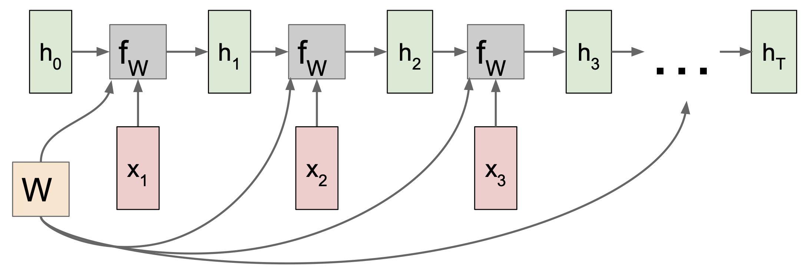

이렇게 x 가 계속해서 들어오면서 W 를 재사용해 연속적으로 H 를 업데이트해주는 방식으로 RNN 이 진행되게 된다.

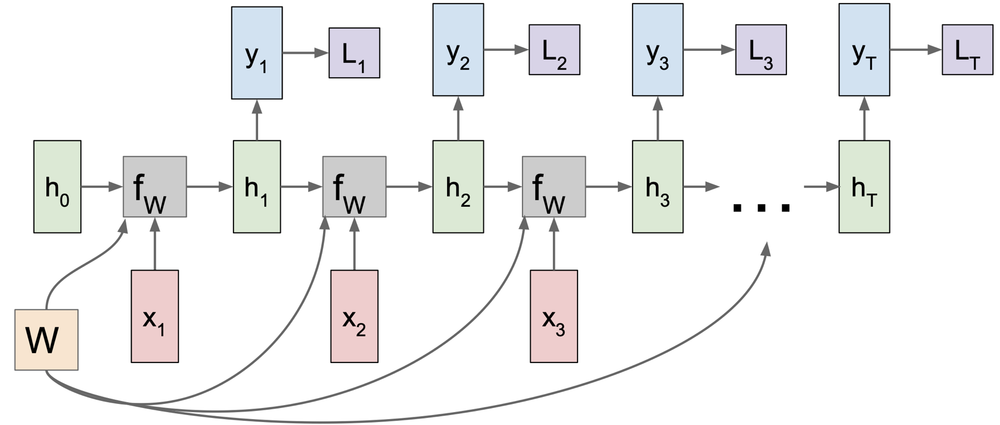

이렇게 재사용되는 W 를 이용해 계산을 하면서 중간에 y 라는 출력을 나타낼 수도 있다. 이 경우에 나중을 위하여 _loss_ 를 계산할 수 있다. 이 _loss_ 를 CNN 에서처럼 학습을 시켜서 W 를 최적화시키게 되는 것이다.

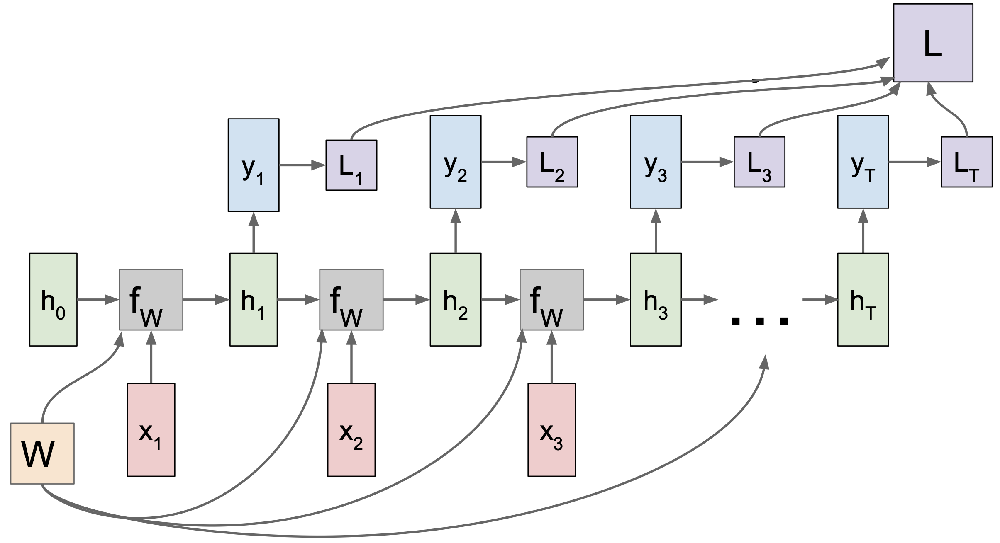

이렇게 개별적으로 계산된 _loss_ 는 예를 들어 _softmax_ 를 이용해서 계산해놓을 수 있다. 여기서 _RNN_ 의 전체 _Loss_ 는 개별 _loss_ 들의 합이라는 것을 알아두자.

이제 _Backpropagation_ 을 구하는 과정을 생각해보자. 여기서 ${dL \over dW}$ 울 구해야 전체 _Backpropagation_ 을 수행할 수 있다.  
CNN 에서 했던 것을 상기해보면, 각 스텝별로 W 에 대한 _local gradient_ 를 구할 수 있다. 이렇게 각각 계산된 _local gradient_ 를 이용해 전체 _gradient_ 를 구하게 된다.

여기까지 Many To Many 모델에 대해서 알아보았다.

그렇다면 Many to One 은 어떨까?

위에서 보듯이 Many to One 에서는 최종 _internal state_ 에서만 결과가 나오게 된다.

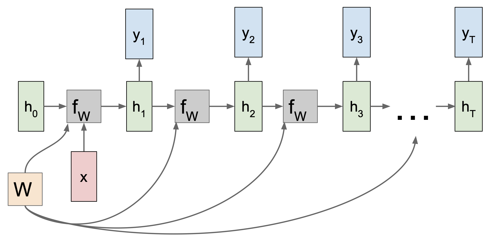

One to Many 에서는 고정된 입력에 대해서 가변적인 출력을 내보내게 된다. 이 때 고정 입력은 모델의 initial internal state 를 초기화 시키는 용도로 사용한다.

머신 번역 같은 것에서는 squence to sequence 모델을 생각해 볼 수 있다. 가변 입출력을 가지게 되는데, Many to One 과 One to Many 의 결합된 형태라고 볼 수 있다.

여기서는 두 개의 stage 를 이용하게 되는데, _encoder_ 와 _decoder_ 라 부른다. 이것들은 가변 입력을 받는 Many to One 형식의 _encoder_ 와 가변 출력을 내보내는 One to Many 형식의 _decoder_ 로 되게 되는데, 영어를 입력 받아 single vector 형태로 문장을 요약한 후, 가변 길이를 갖는 한국어(번역을 한다는 의미)로 출력을 내보내게 되는 그러한 형태이다.

### RNN for Language Model

RNN 은 _language model_ 에서 주로 나오므로 자연어에 대한 예시를 들어 조금 더 살펴보자.

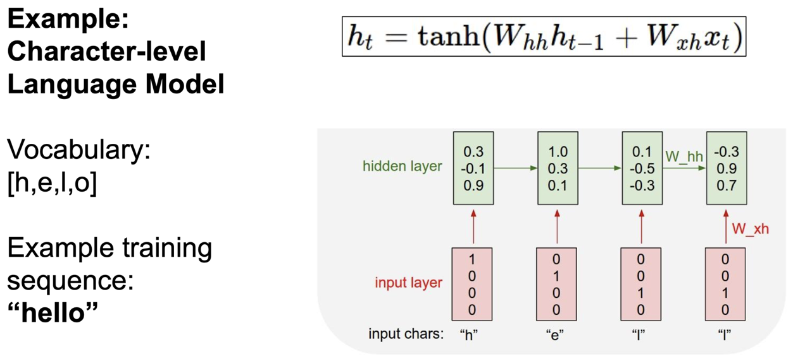

hello 라는 단어에 대해 예시를 들어보자. 여기서 character 는 (h,e,l,o) 로 네 개이다. input 은 (h,e,l,l) 이 되고, output 은 (e,l,l,o) 가 된다. 이렇게 입력이 들어갔을 때 출력이 예측이 되도록 해야하는 것이다.

train time 때 training sequence 로 hello 의 각 character 를 넣어준다. 이 예에서는 hello 가 _RNN_ 의 $x_t$ 가 되는 것이다.

_one-hot encoding_ 을 이용해 총 4가지 character 를 각 자리만 1 이고 나머지는 0인 벡터로 만들어서 값을 계산해보자.

첫 셀에 h 가 들어가고 출력값을 만들어내게 되는데, 이 출력값이 e 를 예측하도록 만들어야 한다.

그런데 여기서 결과를 보면 o 일 확률이 4.1로 가장 높게 나왔다. 즉, 잘못 예측하고 있는 것이다. 마찬가지로 다음 문자들에 대해 진행을 해보면 이전 internal state 를 이용해 새로운 internal state 를 만들게 된다.  
현재의 상태에서는 잘못 예측하는 값들이 많은데, 이러할 경우 _loss_ 가 클 것이고, 적절하게 학습 과정이 진행된다면 나중에는 잘 예측하는 모델이 완성될 것이다.

이 모델의 test time 은 어떨까? 입력값이 들어가면 train 때 모델이 봤을 법한 문자를 만들어 내게 된다. 첫 입력인 h 가 있다면, 모든 character (h,e,l,o) 에 대해 score 가 output layer 로 나오게 된다. test time 에서는 이 score 를 다음 글자 선택에 사용하게 된다.

이 score 의 확률분포를 표현하기 위해 _softmax_ 로 변환하는 과정을 거치는데, h 다음의 문자를 예측하기 위해서 이 확률분포를 사용하게 된다. 가장 큰 score 는 o 였으나, 확률적으로 운이 좋아 e 가 선택된 경우가 바로 위의 이미지이다.

그러한 과정을 거쳐서 test time 때 입력에 대한 출력의 예측값을 표현하게 된다.

score 를 쓰지 않고 확률분포를 쓰는 것에 대해 의아해할 수 있으나, score 만 보았다면 위의 hello 예제에서 올바른 답을 낼 수 없었을 것이다. 실제로 확률분포와 score 를 모두 사용할 수 있다고 하나 확률분포를 사용하는 이유는 모델에서 다양성을 얻을 수 있기 때문이다.

여기서 _backpropagation through time_ 이라는 것을 있다. 앞의 예제에서 매 입력마다 출력값이 존재하는데, 이 출력값들의 _loss_ 를 계산해 _final loss_ 를 얻는 것이 바로 _backpropagation through time_ 이다. 여기서 forward pass 에서 전체 seqeuence 가 끝날 때 까지 출력값이 생성되는데 backward pass 에서도 마찬가지로 전체 sequence 를 가지고 loss 를 계산하게 된다.

이는 sequence 가 굉장히 길다면 매우 비효율적이고 오래 걸리게 된다는 것임을 의미한다.

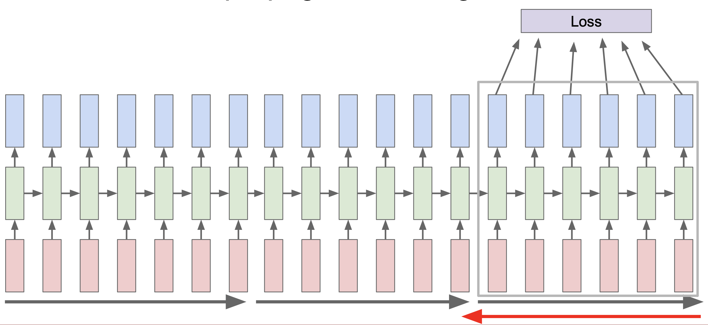

그래서 실제로는 _truncated backpropagation through time_ 을 사용하게 되는데, 이는 train time 의 한 스텝을 일정 단위로 잘라 사용하게 된다. 100개를 잘랐을 경우 100개를 forward 하고 _loss_ 를 계산한 후 gradient step 을 진행하게 된다. 이 과정을 반복하게 되는데 다음 _internal state_ 는 이전 것을 그대로 사용하는 것을 알아야한다. 이는 _CNN_ 에서 _mini batch_ 를 하는 것과 유사하다.

이렇게 language model 에 대해 RNN 으로 학습시키면 셰익스피어의 글, 수학식이 포함되어있는 수학책, 리눅스 커널 등에 대해 입력으로 넣었을 경우 꽤 잘 결과가 나오는 것을 확인할 수 있다. 물론 여기서 결과가 꽤 잘 나왔다는 것은 형식적인 것일 뿐이며 내용적인 측면에서는 전혀 말이 안되는 수준이긴 하다.

### Searching for interpretable cells

_RNN_ 에는 hidden vector 가 존재하는데 이 vector 가 계속해서 업데이트 된다. 이 vector 가 무엇인지 추측해 본 것이 바로 아래의 결과들이다.

딱히 의미가 없는 것도 있지만

"를 기준으로 인용문 같은 것을 패턴으로 인식하고 있는 것도 있고

문장의 길이에 따라 무언가 예측하고 있는 것도 있었다.

코드의 if 문 안에서 조건문 부분을 추적하기도 했다.

그 외에도 주석을 탐지하거나 코드의 깊이(들여쓰기 수준)를 추적하는 cell 도 확인을 할 수 있었다.

### Image Captioning

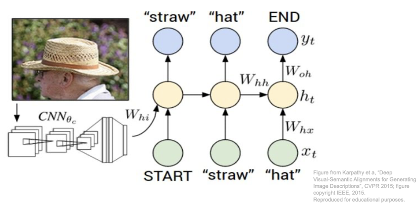

이제 _Image Captioning_ 에 대해 알아보자.  
이는 _CNN_ 과 _RNN_ 을 혼합한 대표적인 예이다. 입력은 이미지가 들어가지만 출력으로는 자연어로 된 caption 이 나오게 된다.

빨간색 네모의 모델에는 입력 이미지를 받기 위한 _CNN_ 이 있다. 그리고 여기서 이미지 정보가 들어있는 vector 가 출력되면 이 것이 _RNN_ 의 input 이 되게 된다. 최종적으로 _RNN_ 은 caption(문장) 을 출력하게 된다.

그렇다면 이 모델이 학습 후 test time 에 어떻게 동작하는지 알아보자.

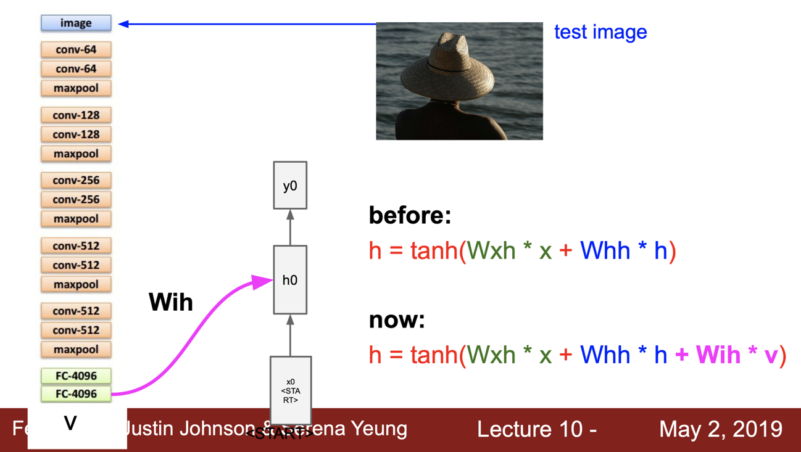

test image 를 넣어 마지막 softmax score 를 사용하지 않고 직전의 _FC layer_ 에서의 vector 를 출력으로 이용한다. 이 때, 이 벡터는 전체 이미지 정보에 대한 요약이다.

이제 _RNN_ 으로 신호가 들어가는데 초기 값은 '문장을 만들라는' 신호인 _Start_ 신호가 들어가게 된다.  
이전까지는 function 에 2개의 가중치 행렬($W_{xh}$, $W_{hh}$)을 입력으로 받았다면 이제 이미지 정보($W_{ih}$)도 더해서 입력으로 들어가게 된다.

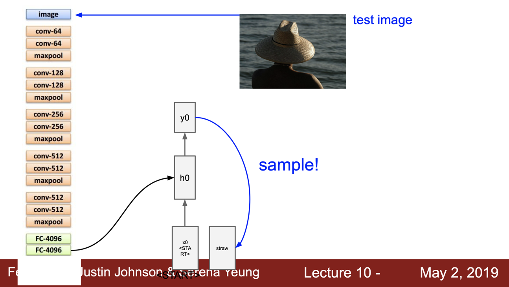

internal state 를 계산할 때마다 모든 스텝에 이 이미지 정보를 추가하게 된다. 그렇게 시작이 되면 샘플링된 단어(y0)가 나오고

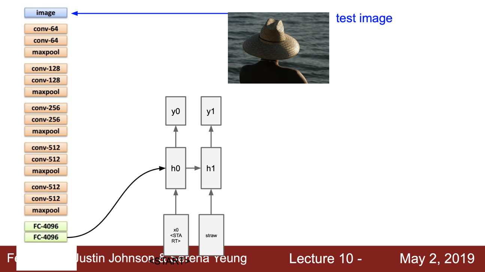

이것이 다음 입력으로 들어가며

반복되게 된다.

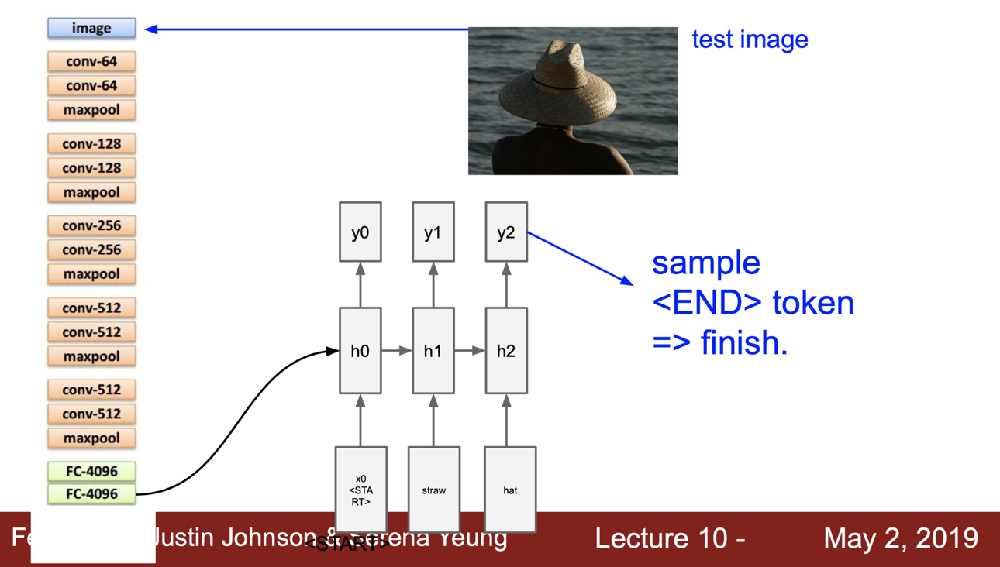

마지막 결과값은 \<END\> 토큰이 나오게 되는데, 이 의미는 더 이상 단어를 생성하지 않으며 이미지에 대한 caption 이 완성되게 된다.

train time 에서는 모든 caption 의 종료지점에 \<END\> 토큰을 삽힙해준다. 학습하는 동안 sequence 의 끝 에서 \<END\> 토큰을 넣어야 한다는 것을 알려줘야하기 때문이다.

이러한 과정은 supervised learning 으로 이우러지는데, 이는 모델을 학습시키기 위해서는 natural language caption 이 있는 이미지가 있어야 한다. 대표적인 데이터셋이 Microsoft coco 인데, 이에 위의 모델을 적용하면 다음과 같은 결과를 얻을 수 있다.

고양이가 나뭇가지 위에 앉아 있다거나, 두 명이 서핑보드를 들고 해변가를 걷고 있다 던가 하는 등의 결과를 보면 굉장히 잘 된 결과를 볼 수 있다.

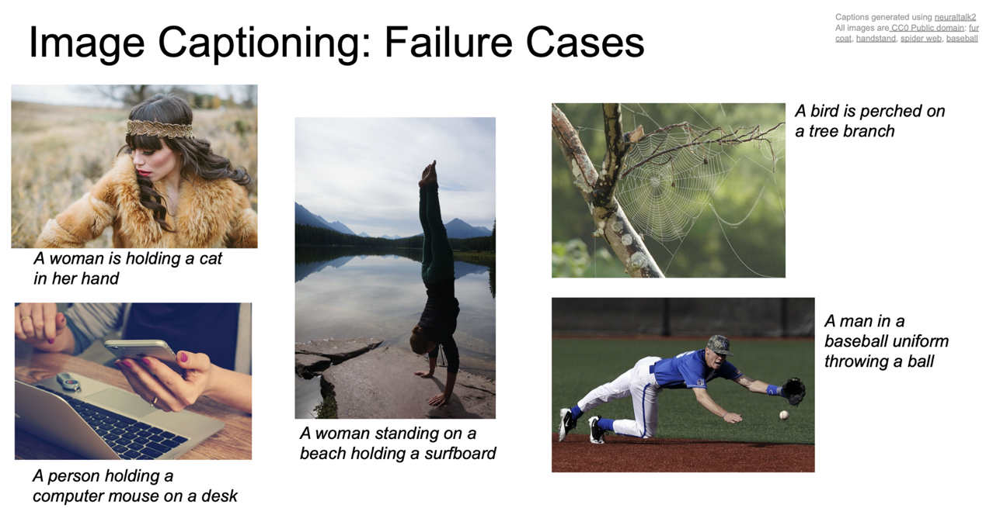

그러나 첫 번째 그림에서 고양이가 없는데도 고양이가 있다고 하는 등의 잘못된 결과도 많이 나오기는 한다. 이는 여전히 발전되어야 할 부분이 많다는 것을 의미한다.

### Image Captioning with Attention

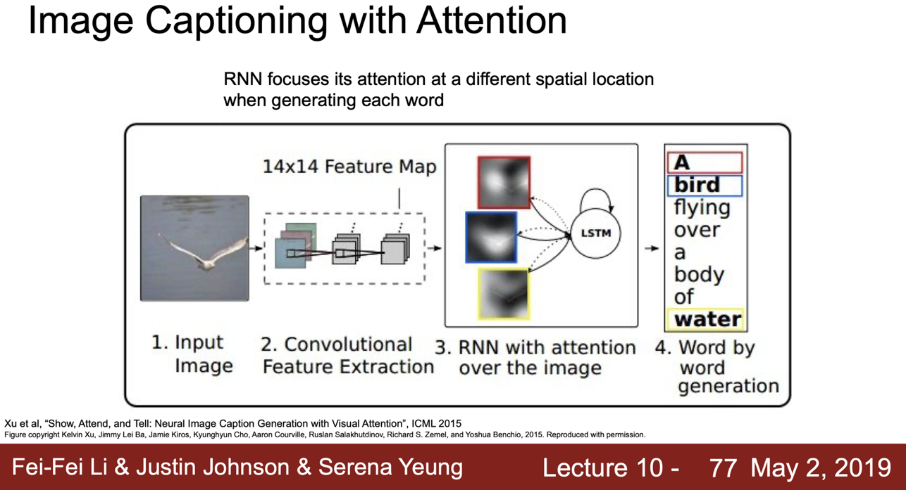

위에서 설명한 것 보다 조금 더 나아가서 _attention_ 에 대해 알아보자. 무언가에 집중했다고 볼 수 있는 이 attention 을 이용한 모델은 caption 을 생성할 때 이미지의 다양한 부분에 대해서 집중(attention)해서 보는 모델이다.

_CNN_ 이 있고 여기서 벡터가 공간정보를 가지고 있는 grid of sector(L x D) 를 만들어낸다.

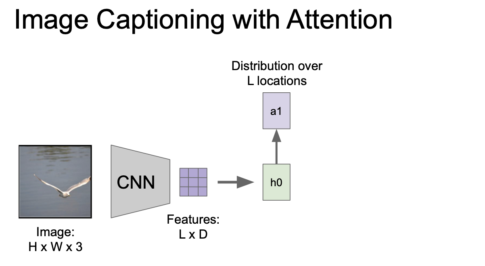

forward 시 매 스탭 vocabulary 에 대해 샘플링을 진행하게 될 때

모델이 이미지에서 보고싶은 위치에 대한 분포를 만들어낸다. 즉 train 때 모델이 어느 위치를 봐야하는지에 대한 attention 이라고 할 수 있다.  
첫 internal state(h0) 는 이미지 위치에 대한 분포를 계산한다. 이것이 a1 이 되고, 이것을 벡터 집팝(L x D) 와 연산해 attention(z1) 을 만들어낸다.

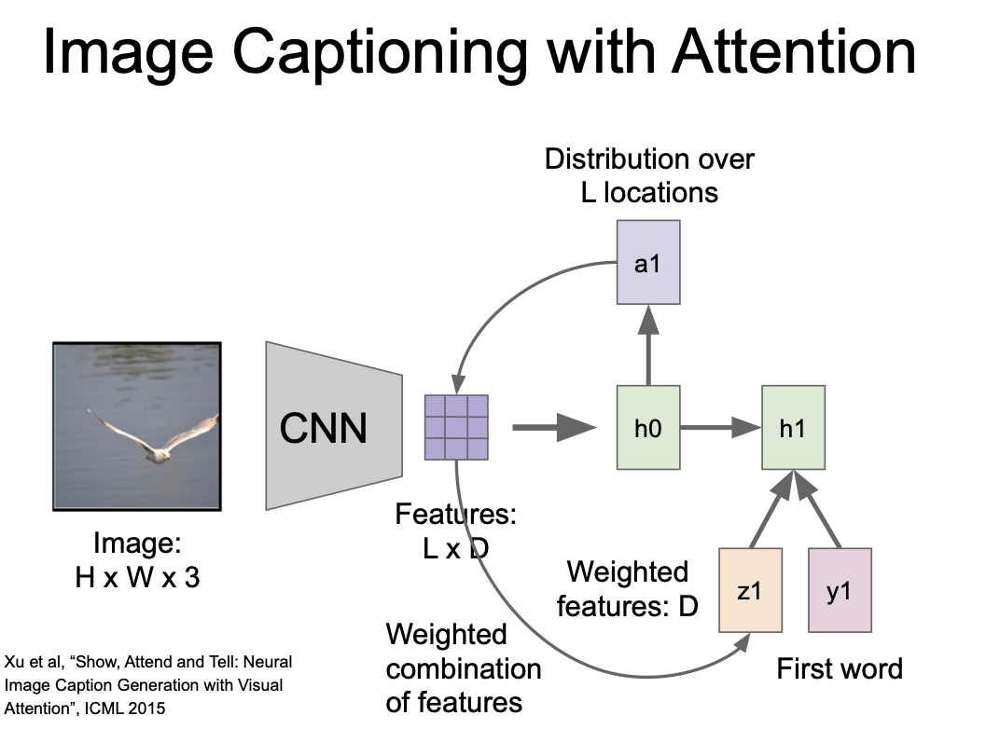

attention vector(z1) 은 neural network 의 다음 스텝의 입력으로 들어간다.

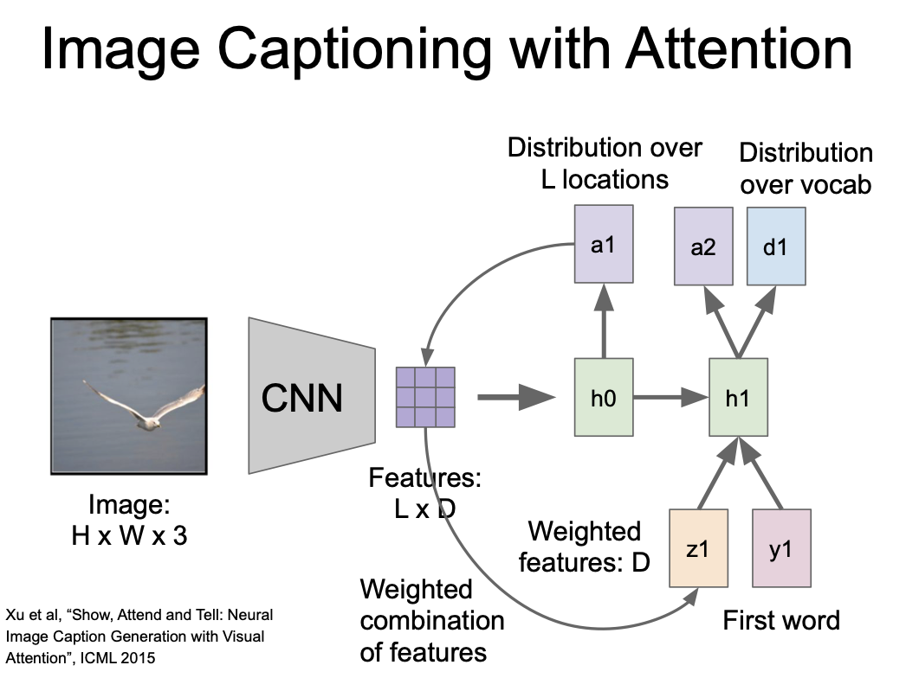

이 때 a2, d1 이라는 두 개의 출력이 만들어진다.

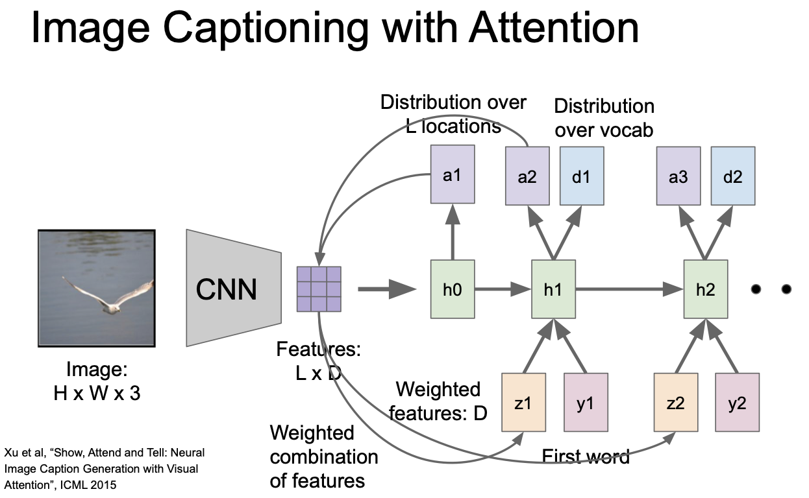

이것을 반복해서 진행하게 된다.

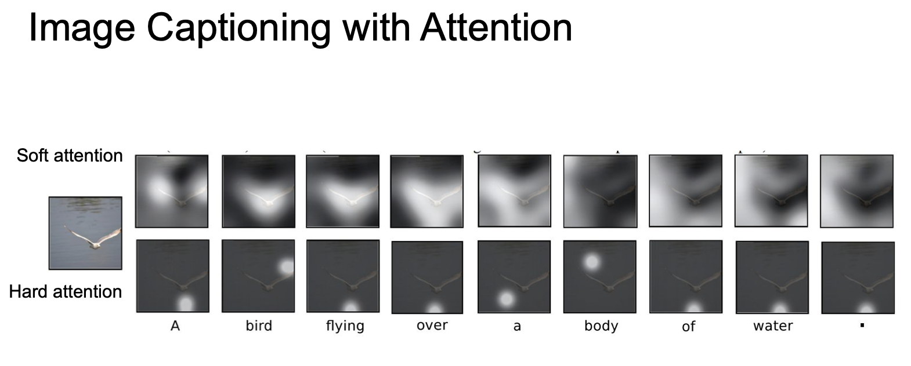

위의 이미지에서 보듯이 train 이 끝나면 모델이 caption 을 생성하기 위해 이미지의 attention 을 이동시키는 것을 확인할 수 있다.

윗 부분이 soft attention 이고, 아래 부분이 hard attention 인데 soft 는 모든 특징과 이미지 위치 간의 weight 를 보고, hard 는 soft 보다 조금 더 부분에 치우쳐서 attention 을 확인하는 것이다.

실제로 train 시킨 후 보면 의미 있는 부분에 attention 을 집중하는 것을 확인할 수 있다.

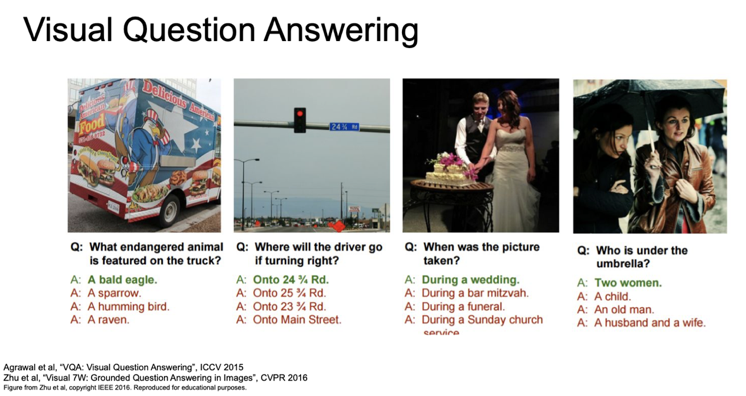

_Visual Question Answering_ 에서는 이미지와 질문이라는 두 개의 입력을 받고 그 질문에 대한 답이 출력이 되게 된다.

이러한 문제도 _RNN_ 과 _CNN_ 을 이용해 만들 수 있다. Many to One 의 방식으로 진행하게 된다.

## LSTM(Long Short Term Memory)

보통은 이렇게 _multilayer RNN_ 을 사용하게 된다. _CNN_ 과 마찬가지로 layer 가 깊어질수록 성능이 좋아지기 때문이다.

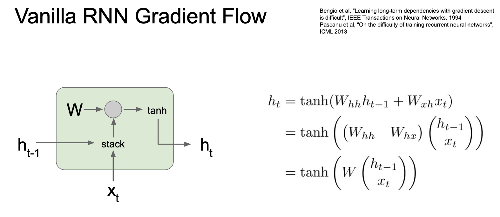

그러나 일반적인 _RNN_ 을 많이 사용하지는 않는다. 그 이유는 바로 학습시킬 때의 문제점 때문이다.

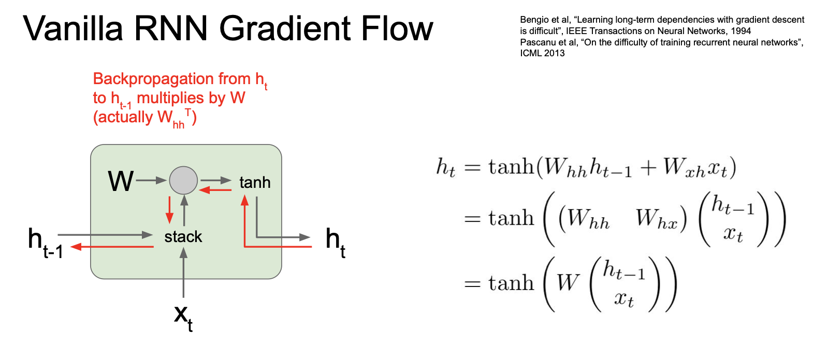

이것이 RNN 의 기본 수식이다. 현재 입력 $x_t$ 와 이전 internal state $h_{t-1}$ 이 들어오게 되고 두 입력을 stack 한다.

이 때 backward pass 에서 gradient 를 계산하는 과정에서 어떤 일이 발생할까? 우선 $h_t$ 에 대한 loss 의 local gradient 를 얻게 되고 그 다음 loss 에 대한 $h_{t-1}$ 의 local gradient 값을 계산하게 된다.  
위의 빨간색 경로로 이것이 진행되게 되는데, 여기서 보아야할 것이 tanh gate 를 타고 mul gate 를 통과한다는 것이다.

이전에 보았듯이 mul agte 는 결국 transpose 를 곱하게 되는 것인데 이는 RNN cells 을 통과할 때마다 가중치 행렬의 일부를 곱하게 되는 것이다.

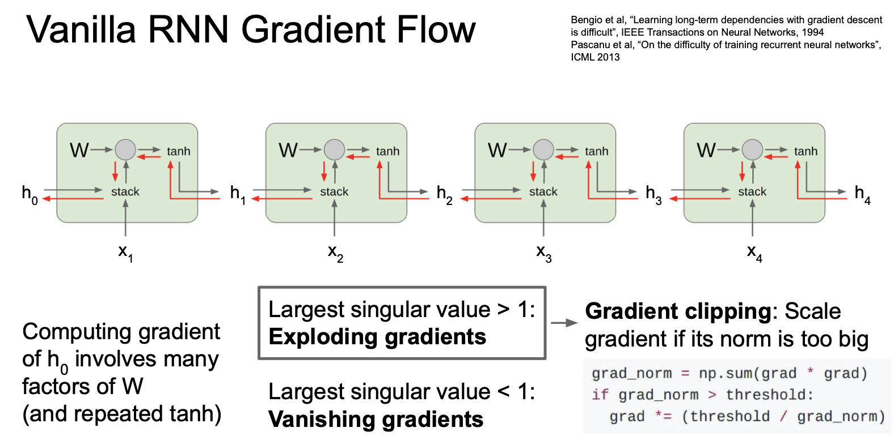

즉 위와 같이 이렇게 반복하게 되고 결국 모든 RNN cells 을 거치게 된다. cell 하나를 통과할 때 마다 각 cell 의 행렬 W transpose 요소가 관여하게 되고 이는 굉장히 비효율적인 연산이 되게 된다.

위 이미지는 4개의 cell 에 대해서만 보여주고 있으나 cell 이 늘어나고 곱해지는 값이 1보다 크거나 1보다 작을 경우 각각 exploding 과 vanishing 의 문제가 발생하게 된다. 커지는 것은 막아본다 치더라도(gradient clipping) 작아지는 것은 결국 gradient vanishing 을 일으키게 된다.

여기서 gradient clipping 은 gradient 의 L2 norm 이 기준값을 초과할 경우 threshold/L2 norm 을 곱해주는 것이다.

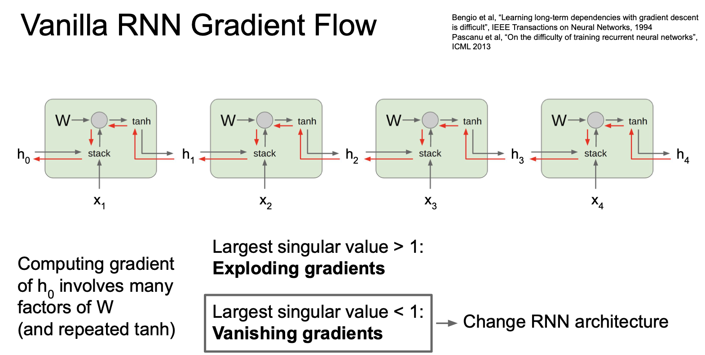

즉 RNN 의 구조를 바꾸는 방법이 필요하게 된다.

그래서 _RNN_ 보다 _LSTM_ 을 선호하는 것이다. 이것은 위에서 언급한 장기 의존성 문제를 해결하기 위해 고안된 구조이다. _LSTM_ 은 $c_t$ 라는 두 번째 벡터가 있다.  
우선 2개의 입력($H_{t-1}$, $x_t$)을 받아 4개의 gate 로 계산하게 된다. ifog 라고 줄일 수 있는데 각각의 게이트의 앞글자를 따서 부르는 말이다. 이 gate 들을 이용해 $c_t$ 를 업데이트한다. 그리고 $c_t$ 를 이용해 다음 스텝의 internal state 를 업데이트하게 된다.

_LSTM_ 의 동작은 다음과 같다. 이전 internal state 인 $h_t$ 와 현재 입력 $x_t$ 는 동일하다.

_Vanilla RNN_ 의 경우에는 이 두 입력을 concatnate 하고 행렬곱 연산을 이용해 internal state 를 구했다. 그러나 _LSTM_ 에서는 2 개의 값을 받고 쌓은(stack) 다음 4개의 gates 를 계산하기 위해 가중치 행렬을 곱해준다. 각 gate 출력은 internal state 크기와 동일하다.

gate 계산은 ifog 로 총 4개이다. i 는 input gate 인데 cell 에서의 입력 $x_t$ 에 대한 가중치이다.

f 는 forget gate 이다. 이전 스텝의 cell 을 얼마나 잊을지 정한다.

o 는 output gate 이다. cell state 를 얼마나 밖으로 출력할 것이냐를 정한다.

g 는 따로 부르는게 없어서 강의자는 gate gate 라 부른다. input cell 을 얼마나 포함시킬지를 정한다고 한다.

이 구조에서는 sigmoid 와 tanh 를 사용하는데, 이전에 이 두 함수의 단점에 대해 많이 언급하였지만 여기서는 잊기 위해서는 0에 가까운 값이 필요하고 기억하려면 1에 가까운 값이 필요하므로 sigmoid 를 사용하게 되었다.  
그리고 tanh 에서 0~1 은 강도, gt 의 범위 -1 ~ 1 은 방향을 나타낸다고 생각하면 될 것이다.

sigmoid gate 출력값과 tanh 함수를 거쳐서 나온 -1 ~ 1 의 값을 곱해서 우리가 원하는 값만 결과 쪽으로 출력하게 되는 것이다.

조금 더 설명을 보태자면 다음과 같다.

벡터 i 의 경우에는 sigmoid 에서 나온 것이므로 0 또는 1이다.  
cell state 의 각 element 에 대해서, 이 cell state 를 사용하고 싶으면 1이 된다. 만약 쓰고싶지 않다면 i = 0 이 될 것이다.  
gate gate 는 tanh 출력이기 때문에 값이 -1 또는 +1 이 되게 된다.  
$c_t$ 는 현재 스텝에서 사용될 수 있는 후보(candidate)라고 할 수 있다.

cell state($c_t$)를 계산하는 전체 수식을 보면 이 수식은 두 개의 독립적인 scaler 값(f, i)에 의해 조정된다. 각 값(f, i)은 1까지 증가하거나 감소하게 된다.  
$c_t$ 의 수식을 해석해보면 이전 cell state($c_{t-1}$)를 계속 기억할지 말지 결정한다. ($f \times c_{t-1}$) 한 다음 각 스텝마다 1까지 cell state 의 각 요소를 증가시키거나 감소시킬 수 있다.  
($i \times g$), 즉 cell state 의 각 요소는 scaler integer counters 처럼 값이 줄었다 늘었다 하는 것으로 볼 수 있다. cell state 를 계산했다면 이제 internal state 를 업데이트 할 차례다. $h_t$ 는 실제 밖으로 보여지는 값이므로 cell state 는 counters 의 개념으로 해석할 수 있다. 즉, 각 스텝마다 최대 +1 또는 -1 씩 세는 것이다.

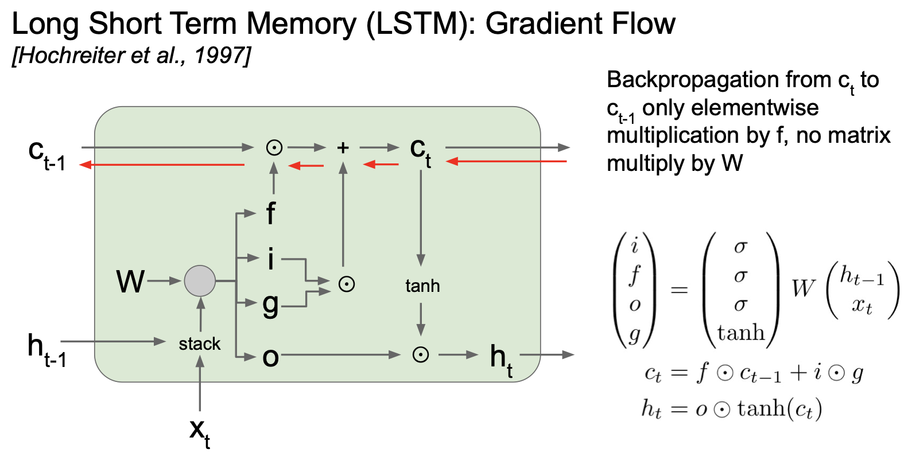

여기서 forget gate 의 elementwise multiplication 이 full matrix multiplication 보다 효율적이기 때문에 더 좋다는 것을 알 수 있고, 이 elementwise multiplication 이 각각의 time step 에 대해 다른 forget gate 로 곱해지게 되므로 exploding 또는 vanishing 문제를 피하는 이점이 생기게 된다.  
이는 sigmoid 로 출력이 되기 때문에 0 ~ +1 사이의 값이 나오게 된다.

bias 를 forget gate 에 줘서 1에 가깝게 만든다면, 이를 통해 vanishing gradient 를 방지할 수 있다. 물론 여전히 vanishing gradient 가 생길 수는 있으나 vanilla RNN 에 비하면 그 정도가 많이 약화된다.

forget gate 가 매번 달라지기 때문에 vanishing gradient 문제가 발생하지 않는다.

여기서 네트워크의 고속도로(highway networks)로 gradient 를 위한 빠른 처리가 가능하게 된다. 이는 마치 _ResNet_ 의 residual block 과 비슷하다.

( + 연산은 gradient 에 대해 distribute 하는 역할을 하게 되는데 이는 backpropagation 을 하는데 있어서 아주 빠르게 계산이 되는 부분이기 때문에 highway 라고 표현할 수 있다.)

GRU(gated recurrent unit) 와 LSTM 이 현재까지 나온 것들 중 적당한 성능을 보이고 있다.
GRU 는 LSTM 과 같이 굉장히 많이 사용되는 모델이다. cell state 없이 internal state 만 있는 것인데 자세한 것은 논문을 읽어보자!

(구글에서 random RNN 으로 아주 많이 다양하게 테스트해봤지만 눈에 띄게 우세한 새로운 구조는 아직까지 없었다고 한다.)

GRU 나 LSTM 에서 보여주는 gradient control 은 아주 유용한 방법이다.

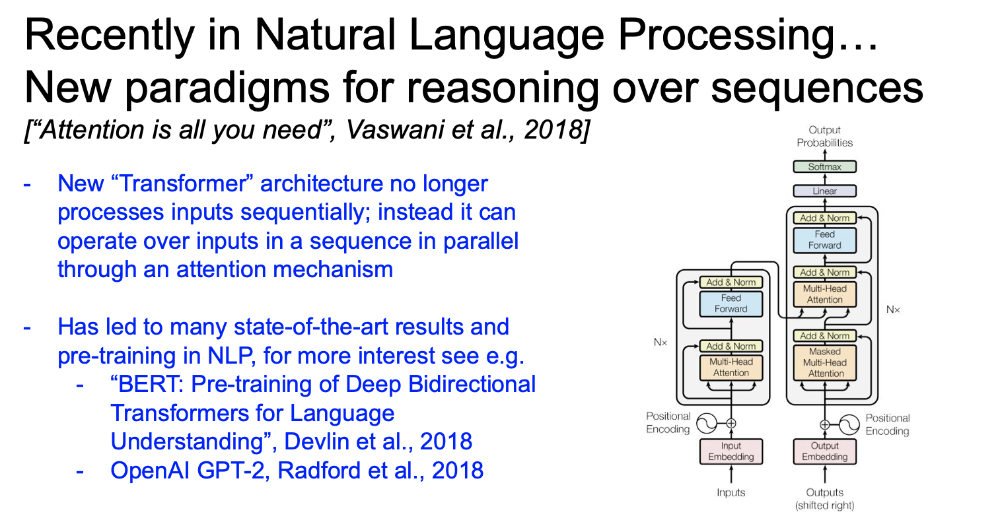

> 이 포스트는 스탠포드의 [cs231n](http://cs231n.stanford.edu) 10강 강의를 보고 공부 및 정리한 포스트입니다.  
> 잘못된 것이 있을 수 있습니다.  
> 댓글로 알려주시면 감사합니다!
