## Graph Pooling  

- Global Pooling : summarize graph into fixed-size representation  
  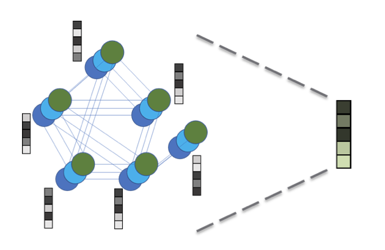  
- Hierarchical Pooling : Learn hierarchical representation  
  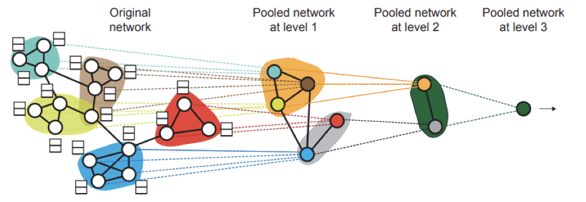

### Global Pooling  

- Simple Readout : Average / Max / Min / ...  
  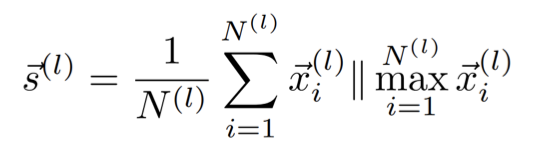  
- Neural Networks for Readout : GG-NN / Set2Set / SortPool  
  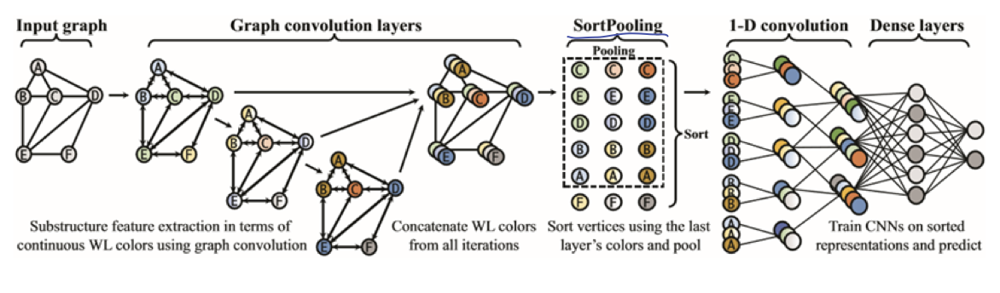
  
### Hierarchical Pooling  

- DiffPool(Differentiable Pooling) : softly assign node from bottom to higher  
  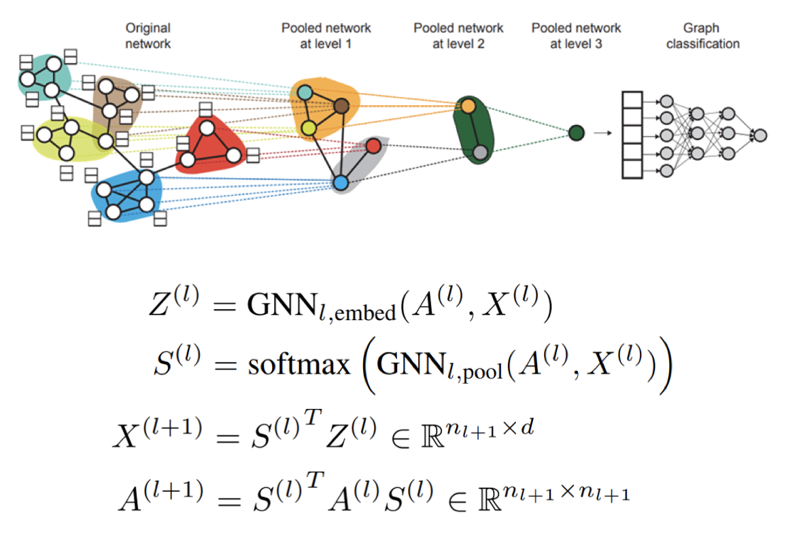  
- gPool(Graph Pooling)  
  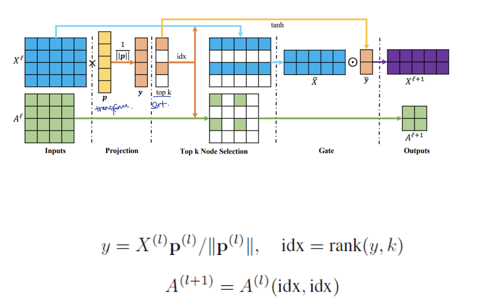  
- SAGPool(Self-Attention Graph Pooling)  
  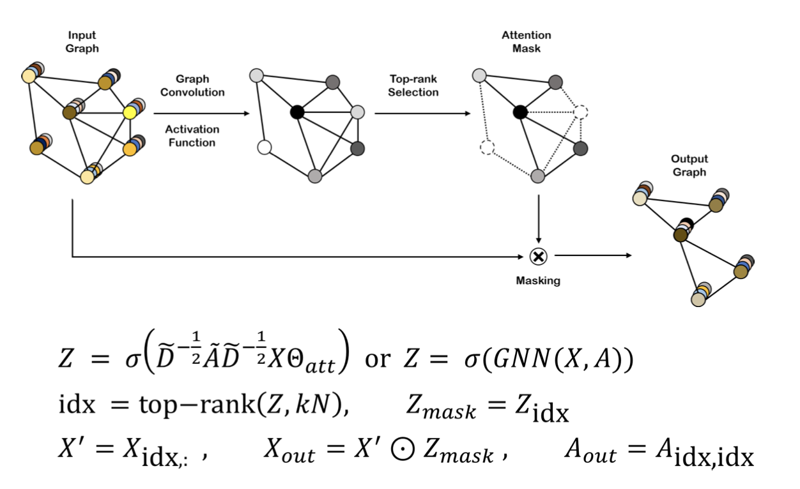  
- EdgePool  
  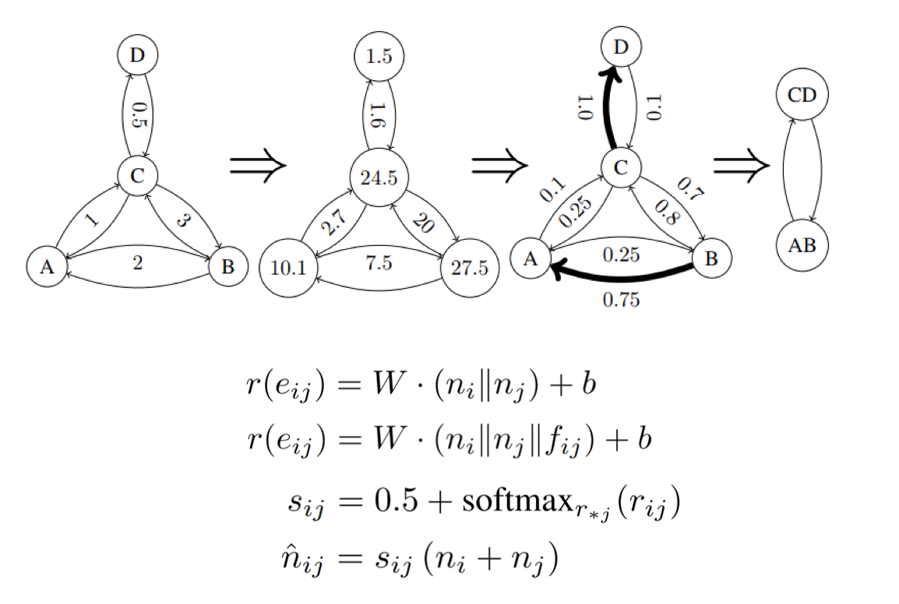

## Scene graph learning 

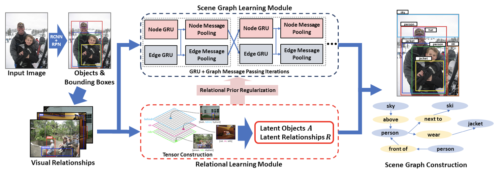

Visual relationships of an image as a graph :  
Predicate detection <=> Object detection

Multi-relational tensor 를 사용함.  
\[\[Object, Predicate, Object \]\] 로 쌍을 만들어 냄

Ground Truth 를 어떻게 해야하는지에 대한 고민이 많이 필요하다.  
(이렇게 저렇게 여러가지 방향으로 해석이 가능하므로)

## Graph Transformer Networks(GTN)

- Spatial Transformer Networks  
  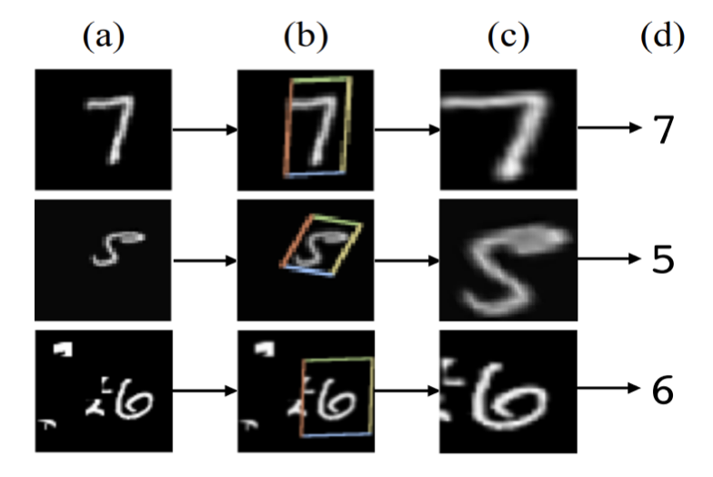

- meta-path : multi-hop 관계를 새로운 path 로 보고 새롭게 네트워크를 구성할 수 있게 함.  
  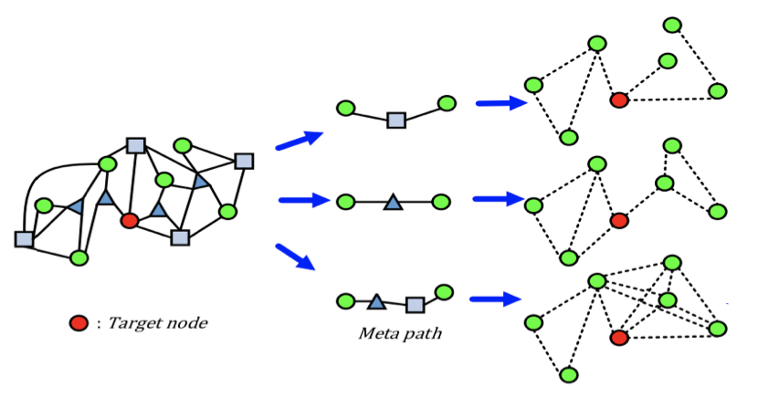

- graph transformer layer : learn a soft selection of edge types and composite relations for generating useful multi-hop connections(meta-paths)  
  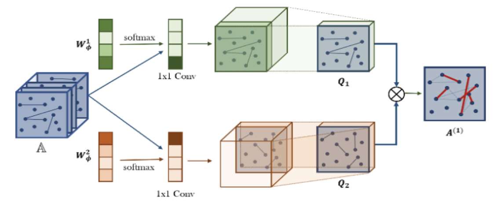
  위의 예제는 2-hop relationship 을 보고 있는 것이다. 마지막에는 meta-path 만 나타난다.

이 때, meta-path 의 길이가 늘어날 수록(hop 이 많아질 수록) 문제점이 발생할 수 있다.  

> 경로가 중복이 되는 문제일까?  
